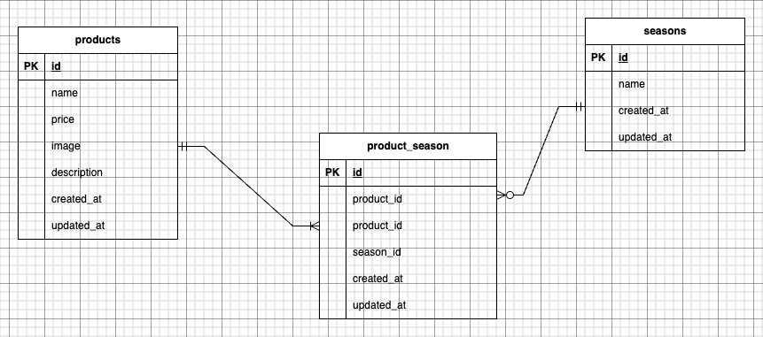

# アプリケーション名

もぎたて

## 環境構築

1.docker-compose exec php bash

2.プロジェクトの作成

```
composer create-project "laravel/laravel=8.*" . --prefer-dist
```

3.env.example ファイルから.env を作成し、環境変数を変更

```
DB_CONNECTION=mysql
DB_HOST=mysql
DB_PORT=3306
DB_DATABASE=laravel_db
DB_USERNAME=laravel_user
DB_PASSWORD=laravel_pass
```

4.アプリケーションキーの作成

```
php artisan key:generate
```

5.マイグレーションの実行

```
php artisan migrate
```

6.シーディングの実行

```
php artisan db:seed
```

## 使用技術(実行環境)

・PHP 7.4.9<br>
・Laravel 8.83.29<br>
・MySQL 8.0.26<br>
・Docker / Docker Compose<br>
・phpMyAdmin<br>

## ER 図



## URL

## URL

- 商品一覧ページ： http://localhost/products

- 商品詳細ページ： http://localhost/products/{productId}

- 商品登録ページ： http://localhost/products/register

- 商品更新ページ： http://localhost/products/{productId}/update

- 商品削除ページ： http://localhost/products/{productId}/delete

- 商品検索ページ： http://localhost/products/search

- phpMyAdmin： http://localhost:8080/
